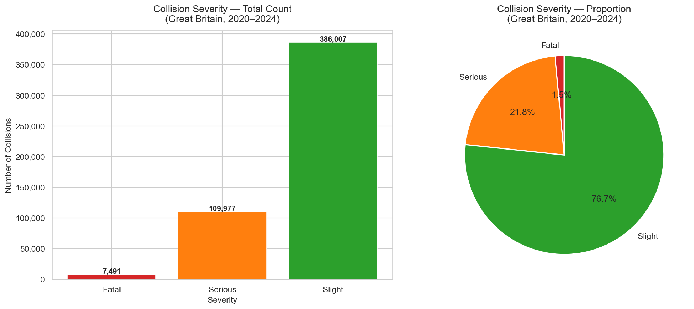
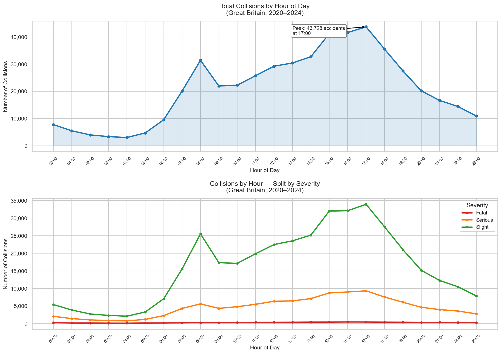
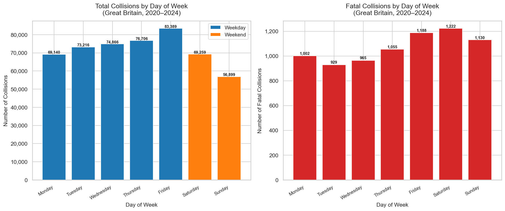
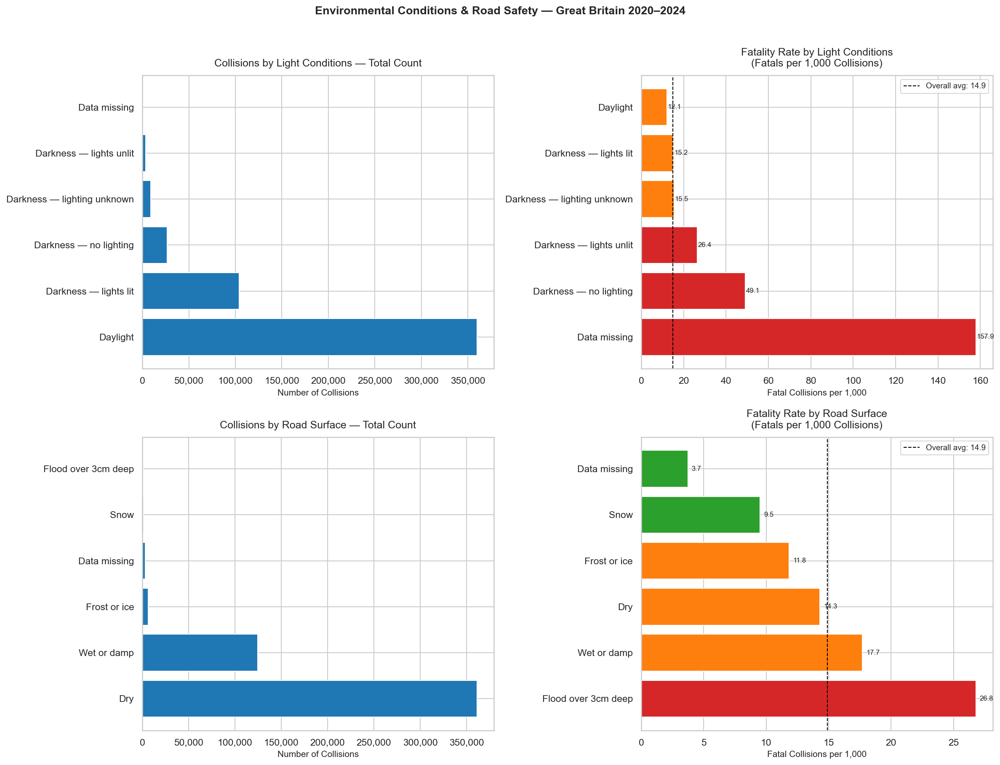

# Project 01 — UK Road Safety Analysis

## Overview

A full exploratory data analysis of road collision data across Great Britain using the official **STATS19 dataset** published by the UK Department for Transport (DfT). This project analyses 503,475 collisions, 920,692 vehicles and 640,522 casualties recorded between 2020 and 2024.

The analysis asks five core questions:

1. How are collisions distributed across severity levels?
2. When during the day do accidents occur — and does severity follow the same pattern?
3. Which days of the week are most dangerous — by volume and by fatality rate?
4. How do light conditions affect collision outcomes?
5. How do road surface conditions affect fatality rates — and what does the counterintuitive result reveal?

All findings are framed as policy-relevant insights for a Department for Transport audience, consistent with the UK Government **DDaT Data Scientist framework at HEO level**.

---

## Key Findings

| #   | Finding               | Result                                                                                                             |
| --- | --------------------- | ------------------------------------------------------------------------------------------------------------------ |
| 1   | Severity distribution | 76.7% slight, 21.8% serious, 1.5% fatal — right-skewed distribution                                                |
| 2   | Time of day           | Total collisions peak at 17:00. Fatal collisions are near-flat across all hours (ratio 3.7x vs 16.1x for slight)   |
| 3   | Day of week           | Friday has most collisions (83,389). Sunday has the highest fatality **rate** (19.9 per 1,000) — 57% above Tuesday |
| 4   | Light conditions      | Darkness with no lighting: 42.1 fatals per 1,000 — nearly 3× the overall average of 14.9                           |
| 5   | Road surface          | Snow (8.5) and frost/ice (11.6) show below-average fatality rates — consistent with risk compensation theory       |

> **Core policy insight:** Fatal accident prevention requires a fundamentally different strategy to injury accident prevention — targeting speed, unlit roads, weekend behaviour and invisible road hazards rather than rush-hour congestion management.

---

## Visualisations

### Chart 1 — Collision Severity Distribution



### Chart 2 — Collisions by Hour of Day



### Chart 3 — Collisions by Day of Week



### Chart 4 — Environmental Conditions



---

## Dataset

| File                                                      | Description                                                        | Rows    |
| --------------------------------------------------------- | ------------------------------------------------------------------ | ------- |
| `dft-road-casualty-statistics-collision-last-5-years.csv` | One row per accident — location, time, road and weather conditions | 503,475 |
| `dft-road-casualty-statistics-vehicle-last-5-years.csv`   | One row per vehicle involved in each accident                      | 920,692 |
| `dft-road-casualty-statistics-casualty-last-5-years.csv`  | One row per person injured or killed                               | 640,522 |

**Source:** [UK Department for Transport — Road Safety Open Data](https://data.gov.uk/dataset/cb7ae6f0-4be6-4935-9277-47e5ce24a11f/road-safety-data)
**Coverage:** Great Britain, 2020–2024
**License:** Open Government Licence v3.0

> Raw data files are not committed to this repository (251MB total). Download directly from the source link above and place in `data/raw/`.

---

## Project Structure

```
project01-uk-road-safety-analysis/
│
├── data/
│   └── raw/                        ← STATS19 CSV files (download separately — gitignored)
│
├── notebooks/
│   └── 01_data_profiling.ipynb     ← Main analysis notebook
│
├── src/                            ← Reusable Python modules (future projects)
│
├── outputs/
│   └── figures/                    ← All saved charts (PNG, 150 DPI)
│       ├── 01_severity_distribution.png
│       ├── 02_collisions_by_hour.png
│       ├── 03_collisions_by_day.png
│       └── 04_environmental_conditions.png
│
├── reports/                        ← Written analytical reports
├── .gitignore                      ← Excludes data, environment, checkpoints
└── README.md
```

---

## Methodology

### Data Profiling

All three STATS19 tables were profiled for shape, data types and missing values before any analysis. Missing values were minimal (65 rows missing GPS coordinates, 80 rows missing current highway authority — both < 0.02% of data) and did not affect the analysis.

### Data Decoding

The majority of columns are stored as integer codes per the DfT STATS19 data guide. All relevant columns were decoded to human-readable labels using official DfT lookup mappings before analysis.

### Analytical Approach

- Univariate distributions examined for all key variables
- Fatality **rates** (fatals per 1,000 collisions) used in preference to raw counts wherever groups of different sizes are compared — controlling for exposure
- Peak-to-trough ratios calculated to quantify how concentrated accidents are across time periods
- All findings framed with policy implications for a DfT / Home Office audience

### Statistical Concepts Applied

- Frequency distributions, mean, median, standard deviation
- Right-skewed distributions and appropriate summary statistics
- Rate calculation to control for exposure differences between groups
- Risk compensation / behavioural adaptation theory applied to road surface findings
- Confounding variable analysis (driver behaviour confounds surface vs fatality relationship)

---

## Reproducing This Analysis

### Prerequisites

- Python 3.10+
- Git

### Setup

```bash
# Clone the repository
git clone https://github.com/insightful-algorithms/project01-uk-road-safety-analysis.git
cd project01-uk-road-safety-analysis

# Create and activate virtual environment
python -m venv ds_env
ds_env\Scripts\activate          # Windows
# source ds_env/bin/activate     # Mac / Linux

# Install dependencies
pip install numpy pandas matplotlib seaborn jupyter ipykernel notebook
```

### Download the data

1. Go to [data.gov.uk — Road Safety Data](https://data.gov.uk/dataset/cb7ae6f0-4be6-4935-9277-47e5ce24a11f/road-safety-data)
2. Download the three `last-5-years` CSV files
3. Place them in `data/raw/`

### Run the notebook

```bash
jupyter notebook
```

Open `notebooks/01_data_profiling.ipynb` and run all cells.

---

## DDaT Framework Alignment

This project is structured against the [UK Government DDaT Data Scientist framework](https://www.gov.uk/guidance/data-scientist) at **HEO level**.

| DDaT Competency                                  | Level        | Evidence                                                                                                                                                          |
| ------------------------------------------------ | ------------ | ----------------------------------------------------------------------------------------------------------------------------------------------------------------- |
| Applied maths, statistics & scientific practices | Practitioner | Descriptive statistics derived from first principles; fatality rates calculated and interpreted; skewness identified mathematically                               |
| Data engineering                                 | Practitioner | Three-table relational dataset loaded and profiled; integer codes decoded to labels; datetime features engineered; project structure and .gitignore applied       |
| Data ethics & privacy                            | Practitioner | Real-world significance of data acknowledged; data quality limitations documented; causal language used carefully — findings framed as associations not causation |
| Data science innovation                          | Practitioner | Risk compensation pattern identified — counterintuitive finding that challenges naive interpretation of road surface data                                         |
| Delivering business impact                       | Working      | All findings framed as DfT / Home Office briefing points with explicit policy implications; visualisations designed for non-technical audience                    |
| Developing DS capability                         | Practitioner | Mathematical foundations derived before code written; teaching notes compiled documenting all concepts learned                                                    |
| Programming & build                              | Practitioner | Reusable `profile_dataframe()` function with docstring; clean commented code; modular notebook structure; warnings identified and fixed                           |
| Understanding product delivery                   | Practitioner | Project scoped as MVP with specific questions, clear deliverables and defined scope boundaries                                                                    |

---

## Technologies Used

| Category            | Tool             | Version |
| ------------------- | ---------------- | ------- |
| Language            | Python           | 3.13.2  |
| Data manipulation   | Pandas           | 3.0.1   |
| Numerical computing | NumPy            | 2.4.3   |
| Visualisation       | Matplotlib       | 3.10.8  |
| Visualisation       | Seaborn          | 0.13.2  |
| Environment         | Jupyter Notebook | 7.5.5   |
| Version control     | Git              | 2.36.1  |

---

## Portfolio Context

This is **Project 01 of 72** in the [insightful-algorithms](https://github.com/insightful-algorithms) data science portfolio.

| Phase                          | Projects | Focus                                                           |
| ------------------------------ | -------- | --------------------------------------------------------------- |
| **Phase 1 — EDA & Statistics** | 01–12    | Statistical analysis across 4 technology eras — _current phase_ |
| Phase 2 — Supervised ML        | 13–24    | Regression, classification, forecasting, causal ML              |
| Phase 3 — Unsupervised ML      | 25–36    | Clustering, recommendation systems, anomaly detection, Neo4j    |
| Phase 4 — Deep Learning        | 37–48    | CNNs, Transformers, GNNs, NLP, computer vision                  |
| Phase 5 — GenAI & LLMs         | 49–60    | RAG pipelines, LLM fine-tuning, chatbots, Azure OpenAI          |
| Phase 6 — Agents & RL          | 61–72    | AI agents, reinforcement learning, full Azure MLOps             |

---

## Author

**Ose Omokhua**
MSc Data Science · BSc Physics 
London, UK

Open to Data Engineer & Data Scientist roles (UK and Remote)

[](https://github.com/insightful-algorithms)
[](https://linkedin.com/in/omokhua-ose)

---

_This project is part of a portfolio built in alignment with the UK Government DDaT Data Scientist framework. All data is open government data published under the Open Government Licence v3.0._
